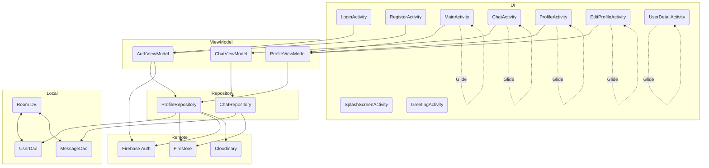

# Chatly – Android Chat App for Learning Modern Development

Welcome to **Chatly**, a learning-focused Android chat application demonstrating modern best practices in app architecture, real-time communication, and cloud integration.  
This project is designed for students, hobbyists, and anyone interested in understanding how to build a scalable chat app using **MVVM**, **Firebase**, **Room**, and popular open-source libraries.

---

## Overview
Chatly is a modern Android chat app using:
- **MVVM** architecture
- **Room** for local database (offline support)
- **Firebase Authentication** for auth
- **Firestore** for user & message storage
- **Cloudinary** for profile photo uploads
- **Glide** for image loading

---
## 🖼️ Screenshots


---
## ✨ What You'll Learn

- **MVVM Architecture**: How to separate UI, business logic, and data layers for maintainable code.
- **Firebase Authentication**: Secure user login and registration.
- **Cloud Firestore**: Real-time storage and retrieval of user profiles and chat messages.
- **Room Database**: Implementing offline caching and local-first data access.
- **Cloudinary Integration**: Uploading and showing profile images from the cloud.
- **Modern UI**: Using Material Design, RecyclerView, custom views, and Glide for image loading.
- **Asynchronous Programming**: Using Kotlin coroutines, StateFlow, and LiveData for reactive updates.
- **Clean Repository Pattern**: Abstracting data sources for robust, testable code.

---

## 🏗️ Project Architecture

**Chatly** follows the MVVM (Model-View-ViewModel) architecture:

- **UI Layer**: Activities, RecyclerViews, Adapters, and custom views (e.g., TypingIndicatorView).
- **ViewModel Layer**: Holds UI state, business logic, and exposes reactive data (LiveData/Flow).
- **Repository Layer**: Manages data sources (local Room database and remote Firebase/Cloudinary).
- **Model Layer**: Data classes for users and messages.
- **Local Database**: Room for offline support and caching.
- **Remote Services**: Firebase Auth for authentication, Firestore for real-time data, Cloudinary for image upload.

---

## Main Layers & Data Flow


---

## Key Technologies

| Layer         | Technology/Library        | Purpose                           |
|---------------|--------------------------|-----------------------------------|
| UI            | Android Activities       | User interface                    |
| UI            | RecyclerView, Adapters   | List users/messages               |
| UI            | Glide                    | Image loading                     |
| UI            | DataBinding/ViewBinding  | View binding                      |
| Local DB      | Room, DAO                | Local caching (messages, users)   |
| Auth          | Firebase Auth            | Login/Register/Logout             |
| Remote DB     | Firestore                | User/message cloud storage        |
| Image Upload  | Cloudinary, OkHttp       | Profile photo upload              |
| MVVM          | ViewModel, LiveData      | State & business logic            |
| Networking    | OkHttp                   | Cloudinary upload                 |

---

## Data Flow Example (Sending a Message)

1. **User** types and sends a message in `ChatActivity`.
2. `ChatViewModel.sendMessage()` is called.
3. `ChatRepository.sendMessage()`:
    - Stores the message in **Room** for offline support.
    - Sends the message to **Firestore** for cloud sync.
4. **Firestore** triggers updates for other users/devices.
5. UI observes Room for real-time updates.

---

## Data Models Summary

- **User/UserEntity**: uid, email, displayName, mobile, photoUrl, dob, gender
- **Message**: id, messageId, senderId, receiverId, content, timestamp, isMine

---

## Component Responsibilities

- **SplashScreenActivity**: Logo animation, auth check, route to main/greeting.
- **GreetingActivity**: Welcome screen, go to login.
- **LoginActivity/RegisterActivity**: Auth forms, state via AuthViewModel.
- **MainActivity**: User list, launches chats, handles logout.
- **ChatActivity**: One-on-one chat, message send/receive, user detail.
- **ProfileActivity/EditProfileActivity**: Show/edit profile, Cloudinary upload.
- **UserDetailActivity**: Show other user info.
- **TypingIndicatorView**: Custom view for "is typing" status.

---

## Storage Structure (Firebase)

- **Firestore**
    - `/users/{userId}`
    - `/messages/{messageId}`

- **Room (local)**
    - `user` table
    - `messages` table

- **Cloudinary**
    - Used to store profile images, save URL in Firestore.

---

## Expandability

- Add presence, typing, and read receipts using Firestore/Realtime Database.
- Secure data with Firebase Security Rules.
- Test offline/online sync thanks to Room + Firestore.

---

## How to Read This Diagram

- **Arrows** show dependencies and data flow.
- **Glide** is used in multiple Activities for images.
- **Repositories** mediate between ViewModels and data sources (local/remote).
- **Room** ensures offline support, Firestore syncs real-time chat.

---

## 📚 Educational Features

- **Full Source Code**: Readable, well-commented code suitable for self-study.
- **Learning-Oriented Structure**: Clear separation of concerns; easy to extend with new features (presence, typing, group chat, etc.).
- **Offline-First Approach**: See how Room and Firestore interact to provide a seamless experience.
- **Profile Management**: Edit, update, and upload profile images.
- **Material Design**: Learn how to craft beautiful and usable Android interfaces.

---

## 🚀 Getting Started

1. **Clone the repository**
    ```bash
    git clone https://github.com/MohsinMuzamil/Chatly.git
    cd Chatly
    ```

2. **Open with Android Studio**

3. **Firebase Setup**
    - Add your `google-services.json` to the `/app` directory.
    - Enable **Authentication** and **Firestore** in the [Firebase Console](https://console.firebase.google.com/).

4. **Cloudinary (Image Upload)**
    - Sign up at [Cloudinary](https://cloudinary.com/).
    - Replace `cloud_name` and `unsigned_preset` in the code with your details.

5. **Build and Run** on an emulator or device.

---

## 🔑 Key Technologies

- **Kotlin**, **Android Jetpack (ViewModel, LiveData, Room)**
- **Firebase Authentication**, **Firestore**
- **Cloudinary** (Image upload via OkHttp)
- **Glide** (Image loading)
- **Coroutines & Flows** (Async/reactive programming)

---

## 🛡️ Security & Best Practices

- **Authentication** required for all chat features.
- **Firestore rules** restrict access to own data/messages.
- **Repository pattern** for data abstraction.
- **MVVM** for a clean, maintainable codebase.

---

## 🧑‍💻 For Learners & Contributors

- **Read the code, change it, break it, extend it!**
- Try adding features like group chat, presence, push notifications, or dark mode.
- Pull requests and suggestions are welcome.

---

## 📄 License

MIT License

---

**Made with ❤️ by Mohsin Muzamil**


